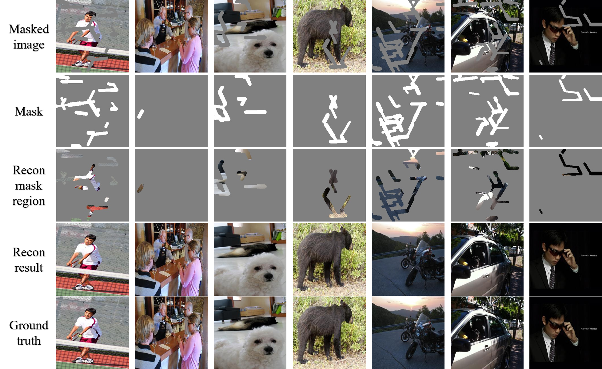
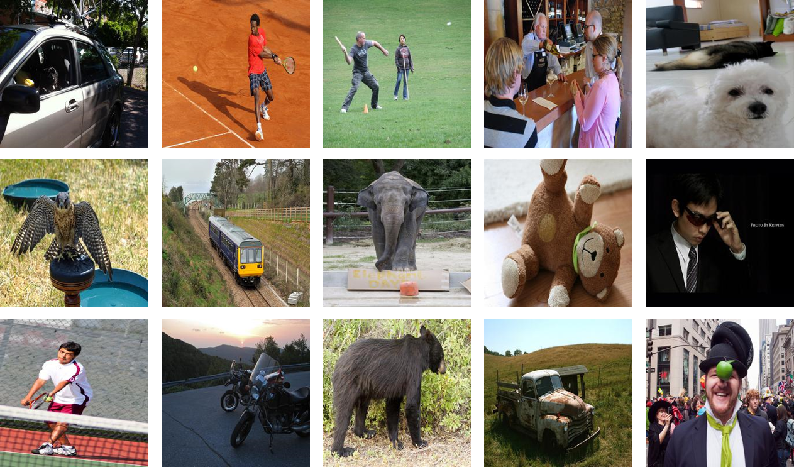

# deepfillv2

The PyTorch implementations and guideline for Gated Convolution based on ICCV 2019 oral paper: free-form inpainting (deepfillv2).

We are focusing on Gated Conv so do not implement original paper completely, and implement it as a coarse-to-fine manner.

## 1 Implementations

Before running it, please ensure the environment is `Python 3.6` and `PyTorch 1.0.1`.

### 1.1  Train

If you train it from scratch, please specify following hyper-parameters. For other parameters, we recommend the default settings.

```bash
python train.py     --epochs 40
                    --lr_g 0.0001
                    --batch_size 4
                    --perceptual_param 10
                    --gan_param 0.01
                    --baseroot [the path of training set, like Place365]
                    --mask_type 'free_form' [or 'single_bbox' or 'bbox']
                    --imgsize 256
```
```bash
if you have more than one GPU, please change following codes:
python train.py     --multi_gpu True
                    --gpu_ids [the ids of your multi-GPUs]
```

### 1.2  Test

At testing phase, please download the pre-trained [model](https://portland-my.sharepoint.com/:f:/g/personal/yzzhao2-c_my_cityu_edu_hk/EvxX5cISk49MiPI0_wFOod8B9JX7lG_ep-rCZjAVHk3j4w?e=xl0s0X) first. (including deepfillv2 network for ~~RGB images~~ and grayscale images)

For small image patches, make sure that all the dataset settings are *the same as training part*:
```bash
python test.py 	    --load_name '*.pth' (please ensure the pre-trained model is in same path)
                    --baseroot [the path of testing set]
                    --mask_type 'free_form' [or 'single_bbox' or 'bbox']
                    --imgsize 256
```

There are some examples:




The corresponding ground truth is:



### 1.3  PSNR experiment on 15 images

| item | 1 | 2 | 3 | 4 | 5 | 6 | 7 | 8 | 9 | 10 | 11 | 12 | 13 | 14 | 15 |
| :--- | :---: | :---: | :---: | :---: | :---: | :---: | :---: | :---: | :---: | :---: | :---: | :---: | :---: | :---: | :---: |
| mask region | 13.23 | 18.23 | 17.06 | 13.16 | 19.41 | 11.47 | 29.58 | 15.51 | 14.71 | 25.99 | 20.54 | 19.21 | 15.86 | 11.79 | 10.73 | 17.10 |
| full image | 26.50 | 45.01 | 32.35 | 29.59 | 31.65 | 24.57 | 48.44 | 30.27 | 32.24 | 51.18 | 35.15 | 36.75 | 30.56 | 27.21 | 29.13 | 34.04 |

### 2  Acknowledgement

```bash
@inproceedings{yu2019free,
  title={Free-form image inpainting with gated convolution},
  author={Yu, Jiahui and Lin, Zhe and Yang, Jimei and Shen, Xiaohui and Lu, Xin and Huang, Thomas S},
  booktitle={Proceedings of the IEEE International Conference on Computer Vision},
  pages={4471--4480},
  year={2019}
}
```
